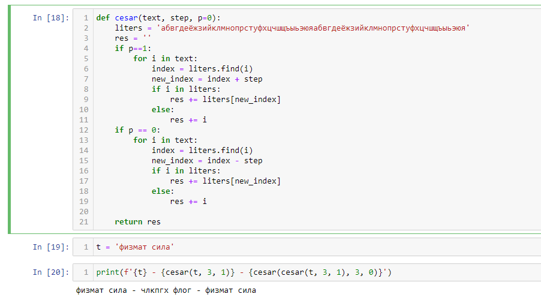
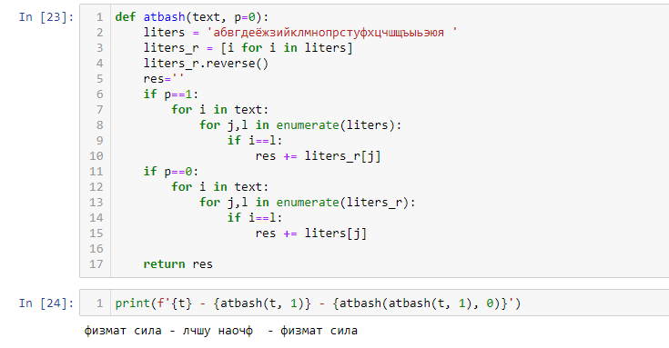

---
## Author
author:
  name: Владислав Носков
  email: 1032262531@rudn.ru
  affiliation:
    - name: Российский университет дружбы народов
      country: Российская Федерация
      postal-code: 117198
      city: Москва
      address: ул. Миклухо-Маклая, д. 6

## Title
title: "Отчёт по лабораторной работе №1"
subtitle: "Шифр простой замены"
license: "CC BY"
---


# Цель работы

Изучение алгоритмов шифрования Цезаря и Атбаш

# Теоретические сведения

## Шифр Цезаря

Шифр Цезаря, также известный, как шифр сдвига, код Цезаря или сдвиг Цезаря — один из самых простых и наиболее широко известных методов шифрования.

Шифр Цезаря — это вид шифра подстановки, в котором каждый символ в открытом тексте заменяется символом находящимся на некотором постоянном числе позиций левее или правее него в алфавите. Например, в шифре со сдвигом 3 А была бы заменена на Г, Б станет Д, и так далее.

Шифр назван в честь римского императора Гая Юлия Цезаря, использовавшего его для секретной переписки со своими генералами.

Шаг шифрования, выполняемый шифром Цезаря, часто включается как часть более сложных схем, таких как шифр Виженера, и все ещё имеет современное приложение в системе ROT13. Как и все моноалфавитные шифры, шифр Цезаря легко взламывается и не имеет практически никакого применения на практике.

Если сопоставить каждому символу алфавита его порядковый номер (нумеруя с 0), то шифрование и дешифрование можно выразить формулами модульной арифметики:

```
y = (x + k) mod n
x = (y - k + n) mod n
```

где
*x — символ открытого текста,
*y — символ шифрованного текста
*n — мощность алфавита
*k — ключ.

С точки зрения математики шифр Цезаря является частным случаем аффинного шифра.

## Шифр Атбаш

Атбаш — простой шифр подстановки, изначально придуманный для иврита. Правило шифрования состоит в замене i-й буквы алфавита буквой с номером n − i + 1, где n — число букв в алфавите.

# Выполнение работы

## Реализация шифра Цезаря на языке Python

Блок шифрования

```
def cesar(text, step):
    liters = 'абвгдеёжзийклмнопрстуфхцчшщъыьэюяабвгдеёжзийклмнопрстуфхцчшщъыьэюя'
    res = ''
    for i in text:
        index = liters.find(i)
        new_index = index + step
        if i in liters:
            res += liters[new_index]
        else:
            res += i
    return res
```

Блок дешифровки

```
def cesar_dec(text, step):
    liters = 'абвгдеёжзийклмнопрстуфхцчшщъыьэюяабвгдеёжзийклмнопрстуфхцчшщъыьэюя'
    res = ''
    for i in text:
        index = liters.find(i)
        new_index = index - step
        if i in liters:
            res += liters[new_index]
        else:
            res += i
    return res
```

## Реализация шифра Атбаш на языке Python

Блок шифрования

```
def atbash(text):
    liters = 'абвгдеёжзийклмнопрстуфхцчшщъыьэюя'
    liters_r = [x for x in liters]
    liters_r.reverse()
    res = ''
    for i in text:
        for j,l in enumerate(liters):
            if i==l:
                res += liters_r[j]
    return res
```

Блок дешифровки

```
def atbash_dec(text):
    liters = 'абвгдеёжзийклмнопрстуфхцчшщъыьэюя'
    liters_r = [x for x in liters]
    liters_r.reverse()
    res = ''
    for i in text:
        for j,l in enumerate(liters_r):
            if i==l:
                res += liters[j]
    return res
```

## Контрольный пример

{ #fig:001 width=70% height=70%}

{ #fig:002 width=70% height=70%}


# Выводы

Изучили алгоритмы шифрования Цезаря и Атбаш.

# Список литературы{.unnumbered}

1. [Шифр Цезаря](https://habr.com/ru/post/534058/)
2. [Шифр Атбаш](https://habr.com/ru/post/444176/)
